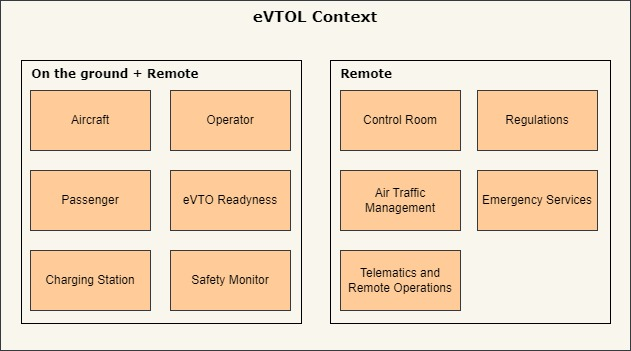

# Concept

### **eVTOL Contexts**  

#### **On the Ground + Remote**

##### **Aircraft**
- **On the Ground**: The eVTOL undergoes pre-flight checks, system diagnostics, and charging. Maintenance and safety inspections ensure operational readiness.
- **Remote**: Monitored by the control room and telematics systems for real-time updates on status, health, and performance via a digital twin.

##### **Operator**
- **On the Ground**: Prepares the aircraft, configures flight plans, and ensures compliance with safety protocols. Interacts with passengers for boarding procedures (if manned).
- **Remote**: Supervises autonomous or semi-autonomous eVTOLs, provides flight control inputs, and monitors live telemetry for safe operations.

##### **Passenger**
- **On the Ground**: Boards the eVTOL, interacts with user interfaces (e.g., ride confirmation, destination input), and follows boarding safety procedures.
- **Remote**: Accesses ride updates, emergency communication channels, and automated support systems during the journey.

##### **eVTOL Readiness**
- **On the Ground**: Includes pre-flight preparations such as system updates, navigation planning, weather checks, and battery/energy-level verification.
- **Remote**: Readiness tracked by the control room via sensors and digital twin analytics, ensuring compliance with operational conditions.

##### **Charging Station**
- **On the Ground**: Provides power for recharging eVTOL batteries. May include automated charging arms and diagnostics to assess battery health and charge levels.
- **Remote**: Charging status monitored by operators and control systems, with alerts for issues or readiness confirmation.

##### **Safety Inspection**
- **On the Ground**: Manual or automated inspection of critical systems (propulsion, sensors, avionics). Ensures airworthiness and identifies potential failures before takeoff.
- **Remote**: Augmented by predictive analytics using telematics data and digital twins, enabling early identification of maintenance needs.

---

#### **Remote Context**

##### **Control Room**
- Acts as the central hub for monitoring and managing the fleet of eVTOLs. Tracks real-time telemetry, manages autonomous operations, and intervenes in emergencies.

##### **Regulation**
- Interfaces with aviation authorities to ensure compliance with airspace rules, safety standards, and operational guidelines.

##### **Air Traffic Management**
- Coordinates with centralized airspace systems to ensure conflict-free routing, collision avoidance, and airspace optimization.

##### **Emergency Services**
- Receives alerts from the eVTOL in case of malfunctions or emergencies. Facilitates search and rescue operations, medical support, and incident response.

##### **Telematics and Digital Twin Analytics**
- Real-time data collected from the aircraft is analyzed to monitor health, performance, and efficiency. Digital twins simulate eVTOL behavior to predict failures and optimize maintenance.

##### **Safety Monitor**
- Tracks and ensures compliance with operational and safety protocols. Monitors environmental conditions (e.g., weather, obstacles) and notifies operators of any risks or deviations.
